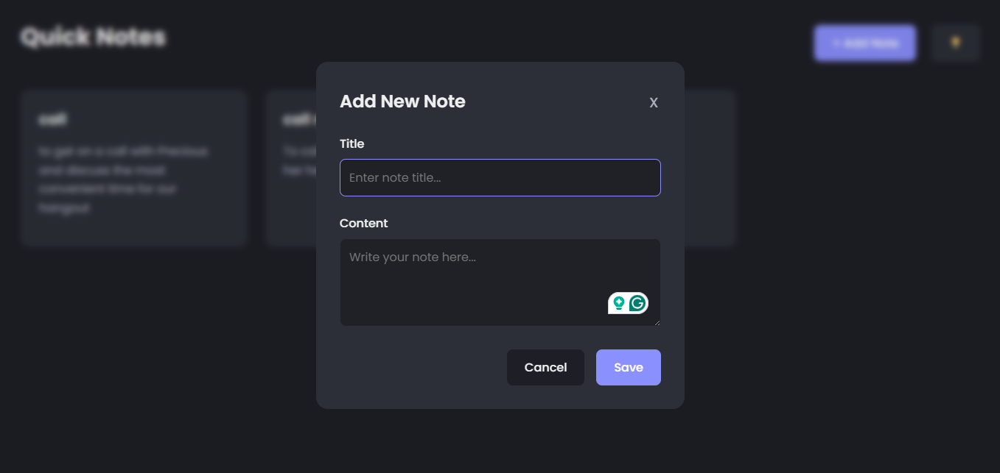
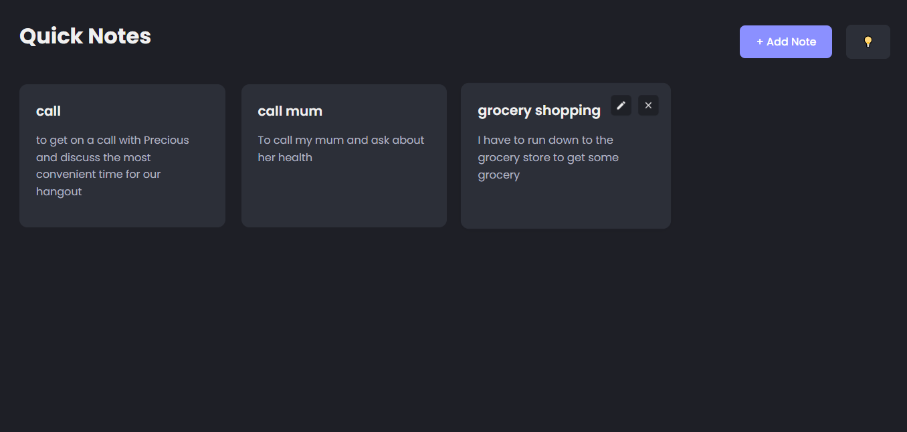

# 📝 Note Taking App

A simple web based note taking app built with HTML, CSS and Javascript. It allows users to write, save, and delete notes directly in the browser using local storage.

## 🚀 Features

- Add new notes
- Delete existing notes
- Persist notes in the browser using local storage
- Responsive and clean UI

## Technologies Used

- HTML
- CSS
- Javascript (vanilla)
- Local Storage API

## Demo




## 📦 Installation

1. Clone the repository

```bash
git clone https://github.com/bunconice/Javascript-projects.git
```

2. Open folder

```bash
cd note-taking-app
```

3. Open `index.html` in browser

📌 Notes
This project is fully client-side and doesn’t use a backend.
Notes are stored in your browser’s local storage, so they will remain even after refreshing or closing the tab (unless you clear storage)
