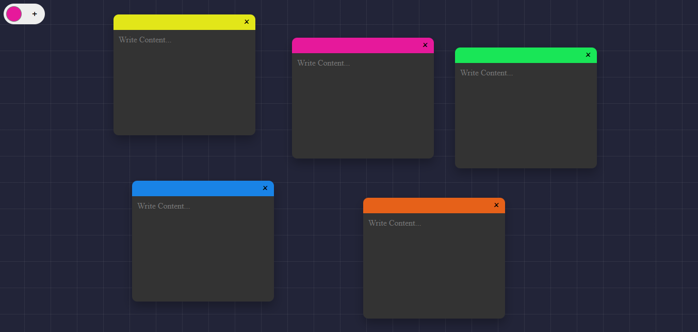

# 📝 Sticky Notes App

A draggable, color-customizable sticky notes web app built with HTML, CSS and vanilla JavaScript.
Users can create, move, and delete notes on a beautiful grid background,just like real sticky notes

## 🚀 Features

- Custom Colors
- Create Notes
- Drag & Drop
- Delete Notes
- Stacking

## Technologies Used

- HTML
- CSS
- Javascript (vanilla)

## Demo



## 📦 Installation

1. Clone the repository

```bash
git clone https://github.com/bunconice/Javascript-projects.git
```

2. Open folder

```bash
cd sticky-notes-app
```

3. Open `index.html` in browser

## 🧠 How it works

**Create a note:**

- Pick a color using the color picker.
- Click the "+" button to add a new note.

**Move a note:**

- Click and drag any note to reposition it.

**Delete a note:**

- Click the "×" button at the top-right of a note.
