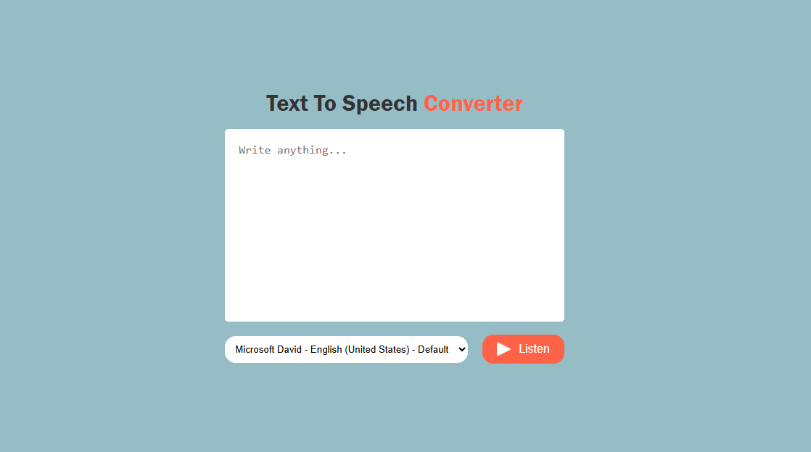

# 🗣️ Text to Speech App

A lightweight web app that converts text into spoken words using the **Web Speech API**. Users can type or paste any text, choose a voice, and hear it read aloud.

## 🚀 Features

- Type or paste text into a textarea
- Choose from available system/browser voices
- Play text as speech with one click
- Supports different languages and accents (depends on system/browser voices)
- Automatically loads available voices on page load

## 🛠️ Technologies Used

- **HTML5**
- **CSS3**
- **JavaScript (ES6)**
- **Web Speech API**

## 📷 Demo

## 📂 How to Use

1. Clone or download this repository
2. Open `index.html` in your browser
3. Type some text into the textarea
4. Select a voice from the dropdown
5. Click the **Speak** button to hear the text
