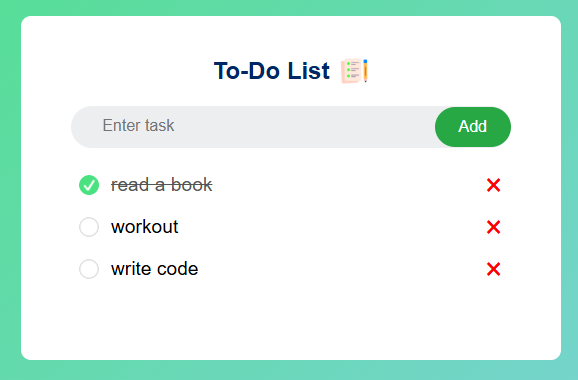

# ✅ To-Do List App

A simple web-based To-Do List application that helps user manage their daily tasks. You can add, delete, and mark tasks as complete, all directly in your browser using local storage.

## 🚀 Features

- ➕ Add new tasks
- ✅ Mark tasks as completed
- 🗑️ Delete tasks
- 💾 Tasks are saved in the browser using local storage
- 📱 Responsive design for mobile and desktop.

## 🛠️ Technologies Used

- HTML5
- CSS3
- Javascript (ES6)
- Local storage API

## 📷 Demo



## 📦 Installation

1. Clone the repository

```bash
git clone https://github.com/bunconice/Javascript-projects.git
```

2. Open folder

```bash
cd todo-list-app
```

3. Open `index.html` in your browser

## 💡 How it works

- When a task is added, it gets saved in the browser's local storage.
- When you refresh or reopen the app, your tasks are still there
- Each task can be marked as done or deleted individually

## 📌 Notes

- This app does not require a backend or user login.
- All data is stored locally in the browser.
